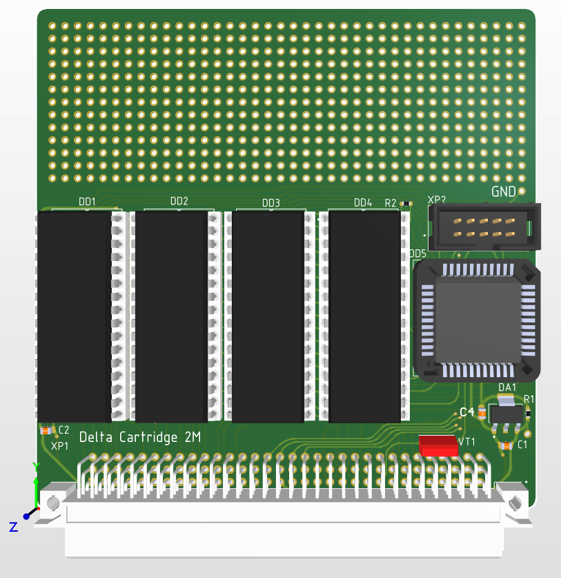
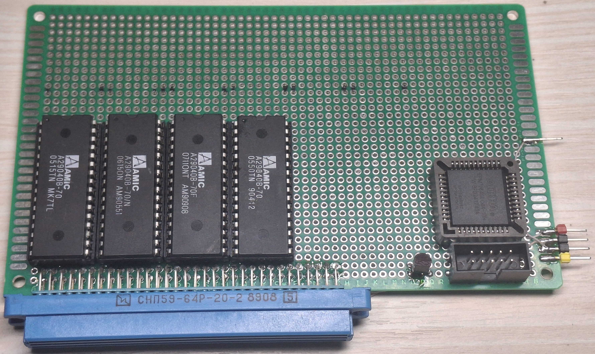
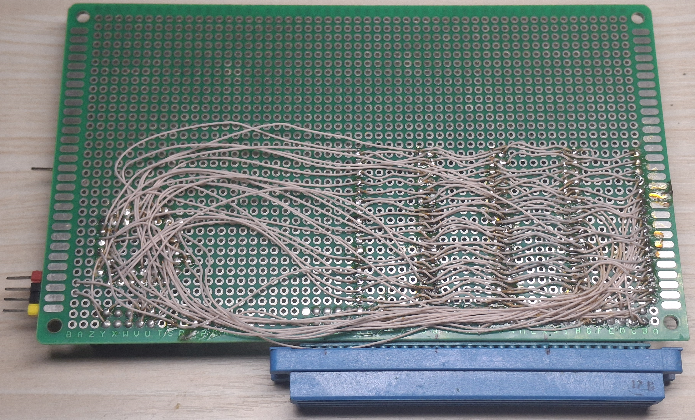

# ZX Cartridge

Проект картриджа для компьютера **Дельта 128К**. Устройство реализовано на четырех 29040 и CPLD, подключается к слоту расширения компьютера. Репозиторий содержит полный набор как исходных файлов, так и файлы для производства.
Также есть схема в pdf. Есть две версии прошивки - для оригинальных картриджей и расширенный вариант.

На текущий момент (23.02.2026) собран макет.

## Функциональность

В процессе тестирования.

---

## Аппаратная часть (HW)

Печатная плата разработана в **Altium Designer** (файл `fix.PrjPCB`).  
Структура папки `HW`:
- `fix.PrjPCB` – проект.
- `src/` – исходные файлы схемы (`main.SchDoc`) и платы (`pcb.PcbDoc`).
- `altium_libs/` – библиотеки компонентов (субмодуль).  
  Библиотеки содержат посадочные места, условные обозначения и 3D-модели (папка `3dmodels` со STEP-файлами).  
  Репозиторий использует **git submodule** для подключения библиотек – это упрощает синхронизацию с обновлениями.

Изображения готового прототипа и модели платы можно найти в папке [`media`](#media).

---

## Программируемая часть (FW)

Прошивка для ПЛИС написана на Verilog и предназначена для синтеза в среде **Quartus** (файлы проекта `zx_cartridge.qpf`, `zx_cartridge.qsf`).  
Основной модуль – `zx_cartridge` (файл `src/zx_cartridge.v`).

## Медиа

В папке [`media`](media) находятся фотографии платы в процессе разработки прототипа.

